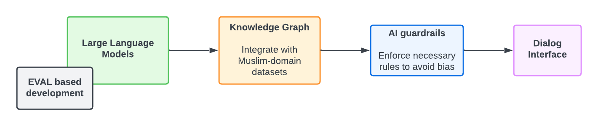

# Domain-Specific LLM

Building an effective Language Model system involves several crucial steps. To begin with, it requires the utilization of evaluation metrics to benchmark the development and selection of LLMs. Then, it involves engineering the right prompt and utilizing Retrieval Augmented Generation, and fine-tuning with evaluation metrics as the north star. Finally, ensuring the presence of a guardrail is important to prevent any malicious activity and establish a trustworthy and reliable LLM system. In addition to score-based evaluation metrics, adversarial testing is required to qualitatively analyze and understand the limitations of built systems.

This repository presents a framework for developing domain-specific Large Language Model (LLM) systems, with a particular focus on aligning with the Islamic worldview. We have presented various approaches, design choices, datasets, prompts, and evaluation of different trade-offs and methodologies. The aim was to construct systems that accurately represent Islamic teachings while addressing the technical and epistemological challenges associated with the nuances of Islamic knowledge. Further research is needed to improve each of the modules, datasets, and assess the technical limitations and epistemological challenges of such systems in more detail.

No system/weights are provided per se as the end goal of this project was not to produce a perfect system but rather provide a framework.

#### Files and Their Descriptions:

- `Islam100QA.csv`: The crucible for evaluating the mettle of the LLM system.
- `RAG_system.ipynb`: The canvas where the Retrieval Augmented Generation with embedchain comes to life.
- `cleaned_hadiths.csv`: The dataset, the lifeblood for RAG and the fine-tuning odyssey of GPT-3.5.
- `llm_evaluation.ipynb`: The crucible where the LLM is put under the lens, employing metrics such as BERT score and cosine distance score to evaluate the engineered prompts.
- `llm_guardrail_system.ipynb`: The realm where the end-to-end LLM system with guardrail code blossoms.

### Example of outputs from fine-tuned LLM showing both the obvious strengths and limitations of these systems

#### Strengths

- `Question`: "What should I do if I want to talk about wrongdoing in the community while avoiding backbiting ?"
- `Answer`: "Praise be to Allah. If you want to talk about wrongdoing in the community without backbiting, you should not mention names or describe the person in such a way that people will know who he is, because that is backbiting. Rather you should speak in general terms, without mentioning any names or describing the person, so that you will be speaking the truth and will not be backbiting. And Allah is the Source of strength. May Allah bless our Prophet Muhammad and his family and companions, and grant them peace. And Allah knows best."

#### Weakness
- `Question`: "Can you explain the six obligatory prayers of the day in Islam?"
- `Answer`: "Praise be to Allah. The six obligatory prayers are: 1. Fajr (dawn prayer): It is two rak'ahs (units of prayer) performed before sunrise. The time for Fajr prayer begins with the true dawn (when the light appears across the horizon) and lasts until sunrise. 2. Dhuhr (noon prayer): It is four rak'ahs performed after the sun has passed its zenith. The time for Dhuhr prayer begins after the sun has passed its zenith and lasts until the shadow of an object is equal to its length. 3. 'Asr (afternoon prayer): It is four rak'ahs performed in the afternoon. The time for 'Asr prayer begins when the shadow of an object is equal to its length and lasts until sunset. 4. Maghrib (sunset prayer): It is three rak'ahs performed after sunset. The time for Maghrib prayer begins after the sun has set and lasts until the red glow (afterglow) in the sky disappears. 5. 'Isha' (night prayer): It is four rak'ahs performed in the night. The time for 'Isha' prayer begins after the red glow (afterglow) in the sky disappears and lasts until the true dawn. 6. Witr (odd prayer): It is an odd number of rak'ahs performed after the 'Isha' prayer. The minimum number of rak'ahs is one, but it is recommended to perform three. The time for Witr prayer is after performing the 'Isha' prayer and lasts until the true dawn. These are the six obligatory prayers in Islam. And Allah knows best."

The question was a trick question as there are 5 obligatory prayers in Islam, not six. 
